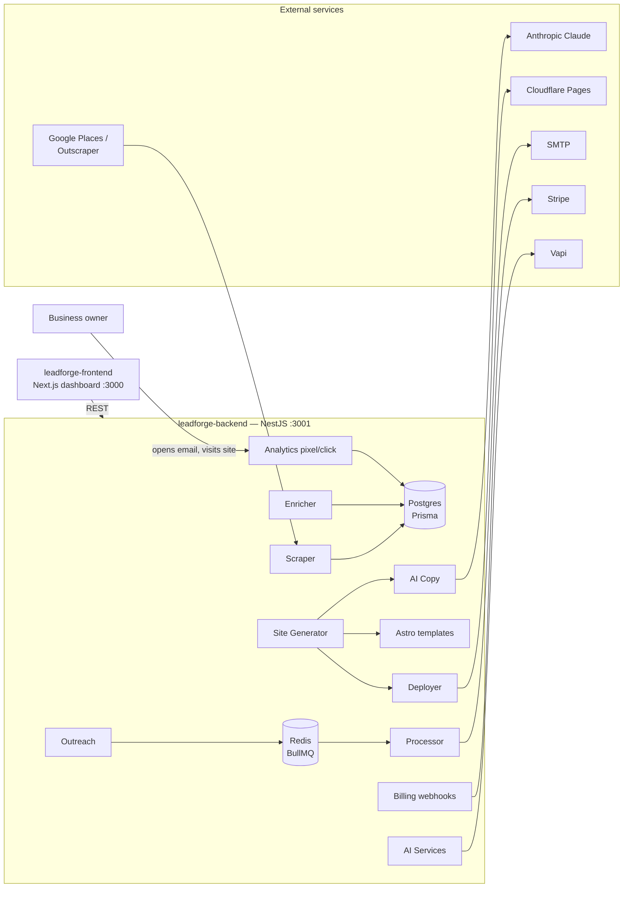

# LeadForge — Backend

LeadForge finds local businesses without websites, builds them AI-generated demo sites, runs email outreach until they claim the site, then upsells AI services (voice receptionist, social media agent, GBP optimization) on a monthly subscription.

This repo is the **NestJS backend API + site generator + CLI**. The admin dashboard lives in the sibling repo [`leadforge-frontend`](../leadforge-frontend) and talks to this API over HTTP.

## Architecture



**Pipeline:** scrape → enrich (email/MX) → generate AI copy → build Astro site → deploy → 4-step email sequence (Day 0/3/7/14) with open/click tracking → Stripe checkout claims the site → client gets AI services.

## Stack

NestJS 11 · Prisma 6 · PostgreSQL · Redis + BullMQ · Anthropic SDK · Astro 5 templates · Stripe · Handlebars email · nestjs-pino · TypeScript strict · **pnpm**.

## Setup

```bash
# 1. Infrastructure — native Postgres/Redis, or:
docker compose up -d          # postgres:16 + redis:7 (ports 5432/6379)

# 2. Configure
cp .env.example .env          # fill in DATABASE_URL at minimum

# 3. Install + database
pnpm install
pnpm prisma:generate
pnpm prisma:push              # create tables
pnpm db:seed                  # optional: 50 demo leads + sites + sequences

# 4. Run
pnpm start:dev                # http://localhost:3001  (GET /health)
```

Every external integration **degrades gracefully** when its key is missing: scraper/AI copy/Stripe/Vapi endpoints return `503` with a clear message, the deployer builds-but-skips-deploy, and outreach runs in **dry-run** mode (marks emails SENT without sending). You can run the whole funnel locally with zero keys.

Site generation requires template deps once per template:

```bash
cd templates/template-trades && pnpm install --ignore-workspace   # repeat per template
```

## Environment variables

| Variable | Purpose | Required |
| --- | --- | --- |
| `DATABASE_URL` | Postgres connection string | ✅ |
| `PORT` / `API_BASE_URL` / `DASHBOARD_URL` | Ports + URLs (3001 / 3000) | defaults |
| `REDIS_URL` | BullMQ queue | default `redis://localhost:6379` |
| `SUPABASE_URL` / `SUPABASE_*_KEY` | JWT auth (bypassed in dev when unset) | prod |
| `GOOGLE_PLACES_API_KEY` / `OUTSCRAPER_API_KEY` | Lead scraping | for scraping |
| `ANTHROPIC_API_KEY` / `ANTHROPIC_MODEL` | AI copy (default `claude-sonnet-5`) | for AI copy |
| `CLOUDFLARE_API_TOKEN` / `CLOUDFLARE_ACCOUNT_ID` / `SITE_BASE_DOMAIN` | Pages deploys | for deploys |
| `SMTP_HOST` / `SMTP_PORT` / `SMTP_USER` / `SMTP_PASS` / `SMTP_FROM_*` | Outreach email (dry-run when unset) | for sending |
| `SENDER_ADDRESS` | CAN-SPAM physical address in footers | recommended |
| `OUTREACH_UNSUBSCRIBE_SECRET` | Signs unsubscribe tokens | prod |
| `STRIPE_SECRET_KEY` / `STRIPE_WEBHOOK_SECRET` | Billing + webhook verification | for billing |
| `VAPI_API_KEY` | AI receptionist | for voice |
| `TEMPLATES_DIR` | Astro templates dir (default `./templates`) | default |

## CLI

Built with nest-commander (`pnpm build` first, then `pnpm cli <command>` or `node dist/cli.js <command>`):

```bash
pnpm cli scrape --query "plumbers in Austin TX" --max 20 --mode api
pnpm cli enrich --city Austin --category plumber --limit 25
pnpm cli generate-site --lead-id <uuid>
pnpm cli generate-sites --city Austin --limit 5
pnpm cli start-outreach --city Austin --category plumber --limit 10
pnpm cli outreach-stats
```

## API endpoints

All responses use `{ data, meta? }`; errors use `{ statusCode, message, error, timestamp, path }`. Routes are JWT-guarded (bypassed in dev without Supabase); webhooks/pixels are public.

| Area | Endpoints |
| --- | --- |
| Health | `GET /health` |
| Leads | `GET /leads` (filters: city, category, status, hasWebsite, page, limit, sortBy, sortOrder) · `GET /leads/stats` · `GET /leads/:id` · `POST /leads` · `PATCH /leads/:id` · `DELETE /leads/:id` |
| Scraper | `POST /scraper/run` `{query, maxResults?, mode?}` |
| Enricher | `POST /enricher/run` `{leadId}` · `POST /enricher/batch` `{city?, category?, limit?}` · `GET /enricher/stats` |
| Sites | `POST /sites/generate` `{leadId}` · `POST /sites/generate-batch` · `GET /sites` · `GET /sites/:id` · `GET /sites/:id/analytics` · `DELETE /sites/:id` |
| Outreach | `POST /outreach/start` `{leadId}` or `{city?, category?, limit?}` · `POST /outreach/pause` · `POST /outreach/resume` · `GET /outreach/stats` · `GET /outreach/sequences` · `GET /outreach/unsubscribe/:token` |
| Analytics | `GET /analytics/events?limit=` · `GET /analytics/pixel/:leadId.gif` · `GET /analytics/click/:stepId/:url` |
| Billing | `POST /billing/checkout` `{leadId, plan}` · `POST /billing/cancel` `{clientId}` · `GET /billing/clients/:id/invoices` · `POST /webhooks/stripe` |
| Clients | `GET /clients` · `GET /clients/stats` · `GET /clients/:id` · `POST /clients` · `PATCH /clients/:id` |
| AI Services | `POST /ai-services/receptionist/setup` · `GET /ai-services/receptionist/:id/calls` · `POST /ai-services/social/generate` · `POST /ai-services/social/schedule` · `GET /ai-services/social/:clientId/calendar` · `POST /ai-services/gbp/report` · `POST /webhooks/vapi` |

Plans: `WEBSITE_ONLY` $99/mo · `WEBSITE_PLUS_VOICE` $299/mo · `FULL_PACKAGE` $499/mo.

## Development workflow

```bash
pnpm start:dev     # API with watch
pnpm typecheck     # tsc --noEmit
pnpm lint          # eslint (flat config, no-any)
pnpm build         # nest build → dist/ (copies .hbs templates)
pnpm prisma:studio # inspect the DB
pnpm db:seed       # reseed demo data
```

- `prisma/schema.prisma` is the single source of DB truth — `pnpm prisma:push` after edits.
- Feature modules are self-contained (`controller + service + dto/`); cross-cutting code in `src/common/`.
- Astro templates in `templates/` share one data-driven `index.astro`; the generator overwrites `src/data.json` and runs `astro build` in a temp dir.
- Typical demo flow: seed → open the dashboard → scrape (needs key) or use seeded leads → enrich → generate sites → start outreach → watch stats.
